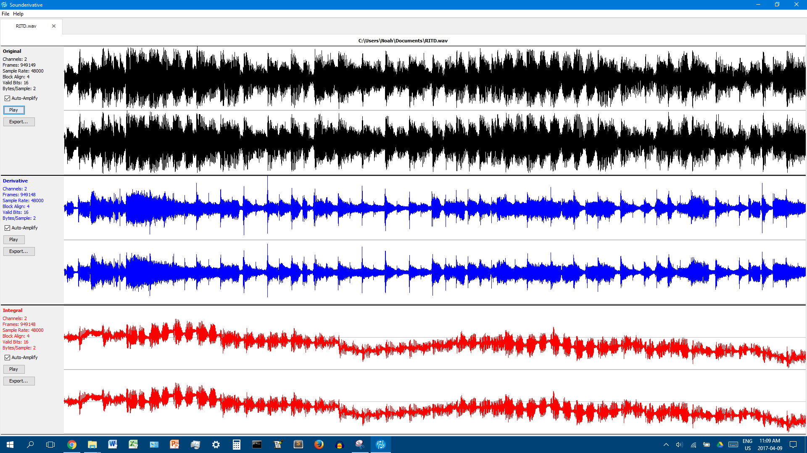

# Sounderivative

A java program to analyze a WAV file and calculate its derivative and integral.

Uses the [Java Wav File IO library](http://www.labbookpages.co.uk/audio/javaWavFiles.html) created by Dr. Andrew Greensted.

# Screenshots

